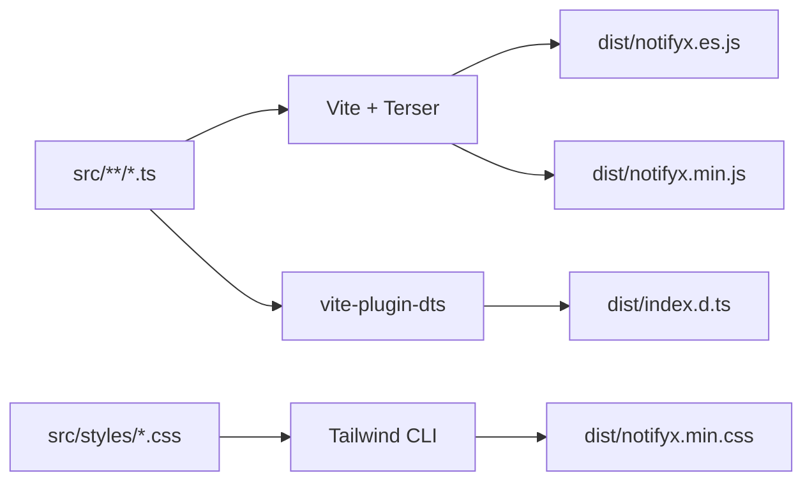

# NotifyX - Quick Reference

## For Developers

### Getting Started
```bash
# Install
bun add notifyx

# Import
import NotifyX from 'notifyx';
import 'notifyx/dist/notifyx.min.css';
```

### Basic Usage
```typescript
// Simple notifications
NotifyX.success('Success!');
NotifyX.error('Error occurred');
NotifyX.warning('Warning!');
NotifyX.info('FYI');

// Advanced
NotifyX.show({
  message: 'Custom message',
  type: 'success',
  duration: 5000,
  position: 'bottom-right',
  dismissible: true,
  onClose: () => console.log('Closed')
});

// Clear all
NotifyX.clear();
```

### TypeScript
```typescript
import NotifyX, { ToastOptions, ToastType, Position, POSITIONS } from 'notifyx';

const options: ToastOptions = {
  message: 'Hello',
  type: 'info',
  position: POSITIONS.TOP_RIGHT
};
```

## For Contributors

### Setup
```bash
git clone https://github.com/awalhadi/notifyx.git
cd notifyx
bun install
```

### Development
```bash
bun run dev          # Start dev server
bun run build:all    # Build everything
bun run verify       # Verify build
```

### Code Style
- Use `const` over `let`
- Functions < 20 lines
- JSDoc for public APIs
- Single responsibility
- Type inference

### Before Commit
```bash
# 1. Build
bun run build:all

# 2. Verify
bun run verify

# 3. Check sizes
ls -lh dist/

# 4. Commit
git commit -m "feat: your feature"
```

## File Guide

### Core Files
- `src/index.ts` - Main entry point
- `src/types/index.ts` - Type definitions
- `src/utils/dom.ts` - DOM utilities
- `src/constants/` - Static values

### Documentation
- `README.md` - User documentation
- `ARCHITECTURE.md` - Design & structure
- `CONTRIBUTING.md` - Developer guide
- `CHANGELOG.md` - Version history

### Configuration
- `package.json` - Package config
- `tsconfig.json` - TypeScript config
- `vite.config.ts` - Build config

### Build Output
- `dist/notifyx.es.js` - ESM bundle
- `dist/notifyx.min.js` - UMD bundle
- `dist/notifyx.min.css` - Styles
- `dist/index.d.ts` - Type definitions

## Bundle Sizes

| File | Size | Gzipped |
|------|------|---------|
| UMD JS | 3.2 KB | **1.4 KB** |
| ESM JS | 6.6 KB | 1.9 KB |
| CSS | 16 KB | 3.7 KB |

## Key Features

✅ Framework agnostic  
✅ TypeScript support  
✅ Zero dependencies  
✅ Tiny bundle (1.4KB gzipped)  
✅ Tree-shakeable  
✅ Accessible (ARIA)  
✅ Dark mode ready  

## Common Tasks

### Add new toast type
1. Update `ToastType` in `src/types/index.ts`
2. Add method in `src/index.ts`
3. Add styles in `src/styles/toast.css`
4. Update docs

### Add new option
1. Update `ToastOptions` interface
2. Update `DEFAULT_OPTIONS` if needed
3. Use in implementation
4. Add JSDoc
5. Update README

### Optimize performance
- Use `Map` for caching
- Minimize DOM queries
- Batch updates
- CSS animations > JS

## Architecture

```
NotifyX (static class)
├── Public methods (show, success, error, etc.)
└── Private helpers (DOM, events, timers)

DOM Utilities
├── Container creation
├── Container caching (Map)
└── Accessibility (ARIA)

Constants
├── POSITIONS
├── ANIMATION_CLASSES
└── DEFAULT_OPTIONS

Types
├── ToastType
├── ToastOptions
├── Position
└── NormalizedToastOptions (internal)
```

## Build Process



## Commands Cheatsheet

```bash
# Development
bun run dev                 # Dev server (localhost:5173)

# Build
bun run build              # Build JS only
bun run build:css          # Build CSS only
bun run build:all          # Build everything

# Verification
bun run verify             # Run verification script

# Publishing (maintainers only)
npm version patch          # Bump version
npm publish                # Publish to npm
```

## Resources

- [NPM Package](https://www.npmjs.com/package/notifyx)
- [GitHub Repo](https://github.com/awalhadi/notifyx)
- [Issue Tracker](https://github.com/awalhadi/notifyx/issues)

## Support

- 📖 Check `README.md` for usage examples
- 🏗️ Check `ARCHITECTURE.md` for design details
- 🤝 Check `CONTRIBUTING.md` for dev guidelines
- 📋 Check `CHANGELOG.md` for version history

---

**License**: MIT  
**Author**: A Awal Hadi  
**Version**: 2.2.35+
